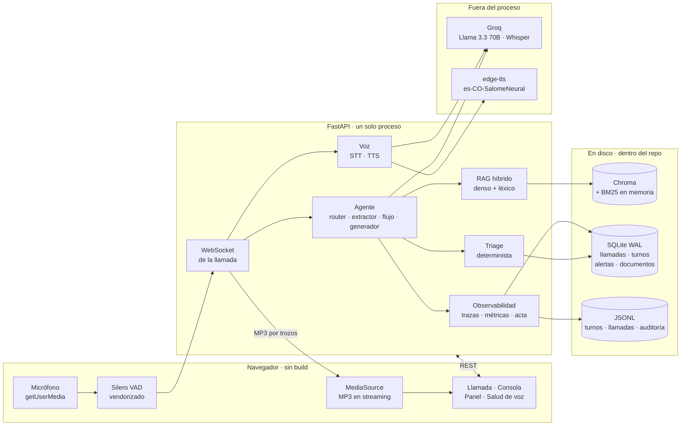
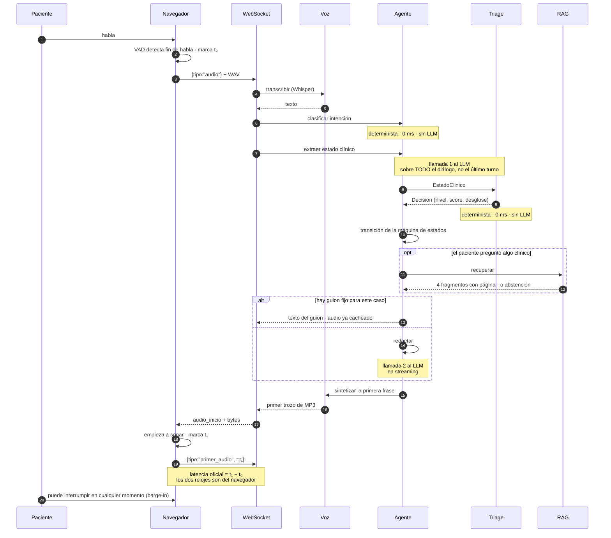
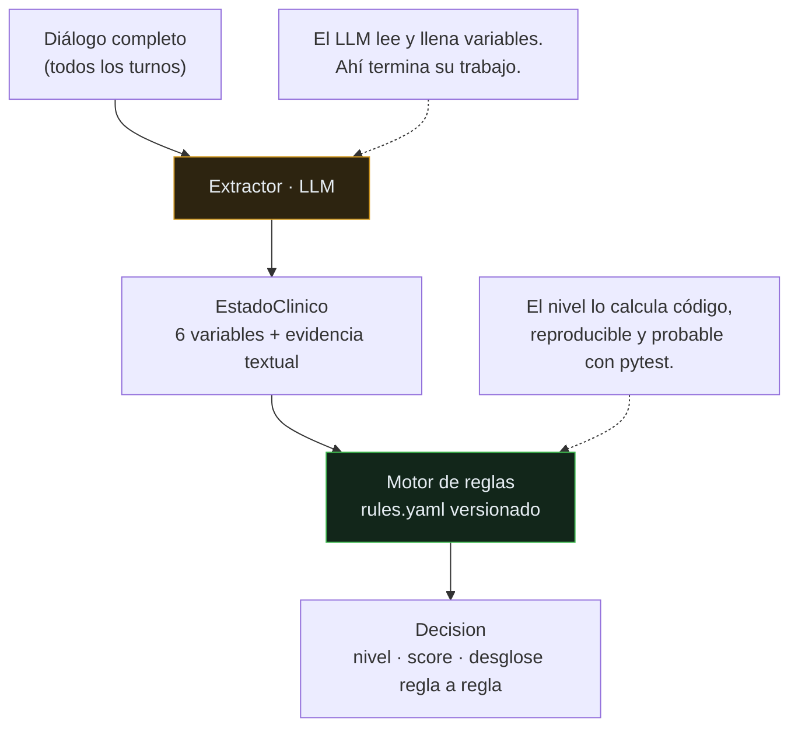
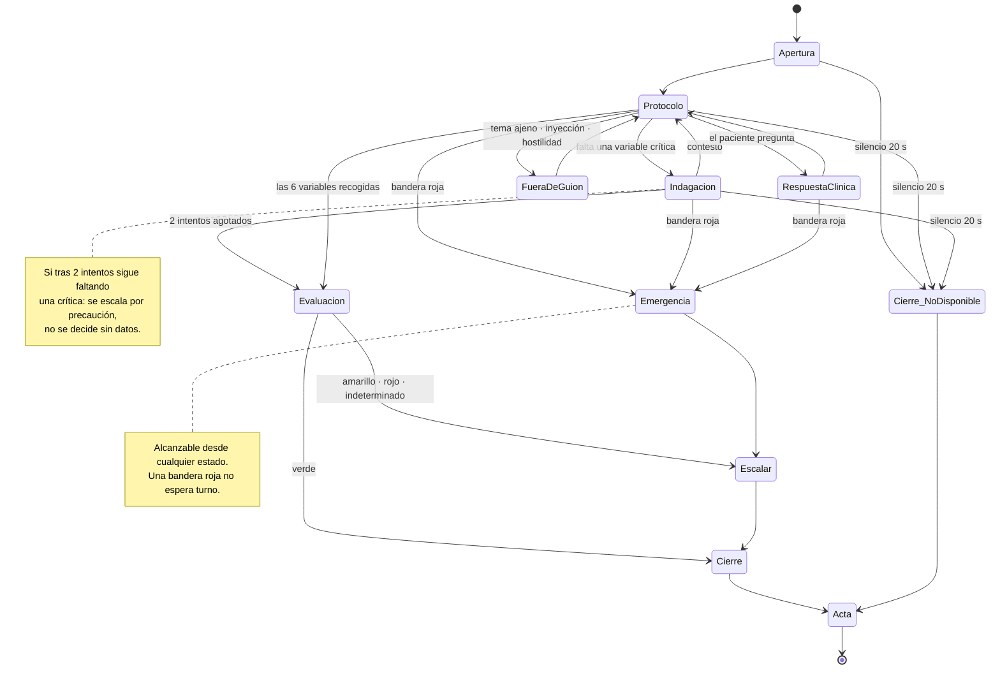
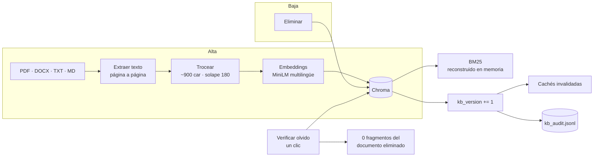

# Arquitectura de postopFriend

Un proceso, un puerto, un comando. Sin Node, sin build, sin Docker, sin servicios
externos más allá de las APIs del modelo.

```bash
uvicorn app.main:app
```

Este documento está escrito para que se pueda tomar cualquier caja de cualquier
diagrama y encontrarla en el código en cinco segundos. La tabla del §6 hace ese
mapeo explícito, caja por caja.

---

## 1. Vista general



**Lo que hay que ver en este diagrama:** el triage no toca a Groq. La flecha del
LLM llega al agente y se detiene ahí. Es la decisión central de la solución y el
§3 la explica.

---

## 2. Un turno de conversación, en orden

Desde que el paciente deja de hablar hasta que vuelve a oír al agente.



**Presupuesto por turno: dos llamadas al LLM.** El router y el triage son
deterministas, así que no gastan ni latencia ni tokens. Es lo que hace que el turno
quepa en el objetivo de 1.5 s.

**La latencia se mide en el navegador, en los dos extremos.** Medirla en el
servidor descontaría el viaje de red y el arranque del audio, es decir, la
maquillaría a favor propio. Ver `app/obs/trace.py`.

---

## 3. Dónde está la frontera entre el LLM y la decisión

Es la apuesta central del diseño, y por eso tiene diagrama propio.



Si el LLM decidiera el nivel: la misma llamada podría dar amarillo hoy y rojo
mañana sin que nadie tocara nada, un cambio de prompt movería decisiones clínicas
sin dejar rastro, y no habría forma de probar el sistema sin gastar cuota de API.

Con la frontera aquí, los 160 casos etiquetados se evalúan en milisegundos y sin
red (`python evals/run_engine_eval.py`), y el desglose del score se puede recomponer
a mano leyendo `app/triage/rules.yaml`.

**`evidencia` es obligatoria.** Una variable con valor pero sin la cita textual del
paciente que lo sustenta se descarta. Es lo que permite contrastar una alerta
contra la grabación en vez de creerle al modelo.

---

## 4. Máquina de estados de la llamada

Los nombres de los estados son literalmente los de `app/agent/flow.py`.



Escrita a mano, no con LangGraph. El grafo tiene siete nodos; un framework habría
traído cuarenta dependencias transitivas —riesgo directo en la compuerta G2— y
habría escondido la instrumentación de latencia que hay que medir a mano.

---

## 5. Conocimiento vivo (compuerta G5)



**BM25 no se guarda en disco**, y eso es una decisión de G5, no una optimización.
Un pickle sería un segundo lugar donde puede sobrevivir un documento que el usuario
ya borró. Derivándolo siempre de Chroma, borrar de Chroma borra de todas partes por
construcción y no por disciplina.

**El procedimiento del paciente se aplica como refuerzo, nunca como filtro duro.**
Si fuera filtro, un documento subido por el jurado —que no pertenece a ninguno de
los cinco procedimientos— quedaría fuera de toda búsqueda y G5 fallaría.

---

## 6. De la caja al archivo

Cada caja de los diagramas de arriba, con el archivo donde vive.

| Caja | Archivo | Qué hace exactamente |
|---|---|---|
| **Navegador** | | |
| Micrófono · captura | [app/static/js/audio.js](../app/static/js/audio.js) | `getUserMedia`, VAD, respaldo «pulsar para hablar» |
| Silero VAD | [app/static/vendor/](../app/static/vendor/) · [app/voice/vendor.py](../app/voice/vendor.py) | modelo y runtime servidos desde el repo, sin CDN |
| MediaSource · reproducción | [app/static/js/player.js](../app/static/js/player.js) | MP3 en streaming, corte por barge-in |
| Interfaz de llamada | [app/static/call.html](../app/static/call.html) · [js/call.js](../app/static/js/call.js) | semáforo en vivo, transcripción, silencios, acta |
| Consola de conocimiento | [app/static/console.html](../app/static/console.html) | subir · listar · eliminar · verificar olvido |
| Panel de observabilidad | [app/static/panel.html](../app/static/panel.html) · [js/panel.js](../app/static/js/panel.js) | alertas, latencias, consumo, costo, historial |
| Salud de voz | [app/static/voice_check.html](../app/static/voice_check.html) | aísla fallos de la cadena de voz en 10 s |
| **Servidor** | | |
| Aplicación · rutas | [app/main.py](../app/main.py) | FastAPI, `/health`, estáticos sin caché |
| WebSocket de la llamada | [app/api/ws_call.py](../app/api/ws_call.py) | protocolo del turno, barge-in, silencios, cierre |
| API de conocimiento | [app/api/kb.py](../app/api/kb.py) | alta, baja, progreso SSE, verificar-olvido, ver fuente |
| API de actas y panel | [app/api/calls.py](../app/api/calls.py) | historial, acta JSON/MD, métricas, alertas |
| **Agente** | | |
| Clasificador de intención | [app/agent/router.py](../app/agent/router.py) | determinista, 0 ms, detecta inyección |
| Extractor clínico | [app/agent/extractor.py](../app/agent/extractor.py) | **llamada 1 al LLM**: diálogo → `EstadoClinico` |
| Máquina de estados | [app/agent/flow.py](../app/agent/flow.py) | los estados del §4, uno por uno |
| Generador de respuesta | [app/agent/generator.py](../app/agent/generator.py) | **llamada 2 al LLM**, en streaming, con citas `[Fn]` |
| Guardarraíles | [app/agent/guardrails.py](../app/agent/guardrails.py) | se ejecutan sobre el texto **ya generado** |
| Guiones fijos es-CO | [app/agent/scripts_es_co.py](../app/agent/scripts_es_co.py) | lo que no se improvisa; audio cacheado |
| Capa del LLM | [app/agent/llm.py](../app/agent/llm.py) | reintento ante 429, tokens, ruta Groq/OpenRouter |
| **Triage** | | |
| Tipos | [app/triage/models.py](../app/triage/models.py) | `Variable`, `EstadoClinico`, `Decision` |
| Reglas | [app/triage/rules.yaml](../app/triage/rules.yaml) | pesos, cortes, banderas rojas, versionadas |
| Motor | [app/triage/engine.py](../app/triage/engine.py) | score y nivel, sin LLM |
| Escalamiento | [app/triage/escalation.py](../app/triage/escalation.py) | SQLite + JSON + MD + webhook |
| **RAG** | | |
| Ingesta | [app/rag/ingest.py](../app/rag/ingest.py) | PDF/DOCX/TXT/MD, conserva la página |
| Troceado | [app/rag/chunker.py](../app/rag/chunker.py) | ~900 car, cabecera contextual |
| Embeddings | [app/rag/embedder.py](../app/rag/embedder.py) | fastembed ONNX, MiniLM multilingüe |
| Índices | [app/rag/store.py](../app/rag/store.py) | Chroma + BM25 derivado en memoria |
| Recuperación | [app/rag/retriever.py](../app/rag/retriever.py) | denso + léxico, RRF, MMR, abstención |
| Alta y baja | [app/rag/pipeline.py](../app/rag/pipeline.py) | el mismo camino para el corpus base y lo subido |
| **Voz** | | |
| Transcripción | [app/voice/stt.py](../app/voice/stt.py) | Whisper; nunca rellena lo que no entendió |
| Síntesis | [app/voice/tts.py](../app/voice/tts.py) | edge-tts, caché de guiones |
| Segmentador | [app/voice/segmenter.py](../app/voice/segmenter.py) | corta en la primera frase para hablar antes |
| **Persistencia** | | |
| Esquema y conexión | [app/store/db.py](../app/store/db.py) | SQLite WAL, migraciones idempotentes |
| Fichas de paciente | [app/store/patients.py](../app/store/patients.py) | solo lo que tendría un HIS: sin la trayectoria real |
| Acta de llamada | [app/store/acta.py](../app/store/acta.py) | las diez secciones, JSON y Markdown |
| **Observabilidad** | | |
| Traza del turno | [app/obs/trace.py](../app/obs/trace.py) | etapas, tokens, latencia del cliente |
| Escritura de logs | [app/obs/logger.py](../app/obs/logger.py) | JSONL de turnos, llamadas y auditoría |
| Precios | [app/obs/tokens.py](../app/obs/tokens.py) | tarifas con fuente y fecha de consulta |
| Métricas | [app/obs/metricas.py](../app/obs/metricas.py) | **una sola implementación** para panel, acta e informe |

---

## 7. Decisiones que se apartan de lo obvio

| Decisión | Alternativa descartada | Por qué |
|---|---|---|
| Máquina de estados a mano | LangGraph | 7 nodos no justifican 40 dependencias transitivas (riesgo G2) y el framework escondería la instrumentación de latencia |
| Triage determinista | El LLM asigna el nivel | reproducible, auditable, probable sin gastar cuota; un cambio de prompt no puede mover una decisión clínica |
| BM25 en memoria | `bm25.pkl` en disco | un pickle es un segundo sitio donde sobrevive un documento borrado: rompería G5 |
| Frontend sin build | React/Vite | cada paso antes de ver la solución corriendo es una oportunidad de fallar G2, y «la estética no puntúa» |
| Latencia medida en el navegador | medirla en el servidor | el servidor no ve el viaje de red ni el arranque del audio: el número saldría mejor de lo que es |
| Guardarraíles sobre el texto generado | solo instrucciones en el prompt | «casi siempre funciona» en salud es una forma cara de decir «a veces no» |
| VAD vendorizado | cargarlo de un CDN | la evaluación puede correr sin red; un CDN caído tumbaría la compuerta G4 |
| Métricas generadas por script | tabla escrita a mano | la rúbrica contrasta lo reportado contra los logs |

---

## 8. Qué pasa cuando algo falla

Ningún fallo de una pieza puede tumbar la llamada.

| Falla | Qué hace el sistema | Dónde |
|---|---|---|
| El VAD no arranca | cae a «pulsar para hablar»; se ve en `/salud-voz` | `app/static/js/audio.js` |
| El STT devuelve vacío | pide repetición, **nunca inventa** lo que no entendió | `app/voice/stt.py` |
| Cuota del LLM agotada (429) | reintenta esperando lo que el propio servidor indica | `app/agent/llm.py` |
| El LLM no responde | los guiones fijos siguen funcionando: no pasan por el modelo | `app/agent/scripts_es_co.py` |
| El corpus no cubre la pregunta | se abstiene y lo declara, en vez de improvisar | `app/rag/retriever.py` |
| El webhook de alerta cae | la alerta ya quedó en SQLite, JSON y MD | `app/triage/escalation.py` |
| El TTS falla | se manda el texto y se registra la incidencia | `app/api/ws_call.py` |
| La llamada se corta | el acta se genera igual, marcada `incompleta` | `app/store/acta.py` |
| El paciente no contesta | 6 s → 12 s → 20 s y cierre por protocolo | `app/api/ws_call.py` |

---

## 9. Cómo verificar este documento

```bash
python scripts/doctor.py            # dependencias, vendor de voz, índice, claves
python -m pytest -q                 # la suite completa, sin red
python evals/run_engine_eval.py     # 160 casos etiquetados, sin gastar API
python scripts/report_metrics.py    # las métricas del README, desde data/postop.db
```

Y con el servidor arriba: `/salud-voz` comprueba la cadena de voz entera en diez
segundos y dice cuál de las cuatro piezas falla si alguna falla.
