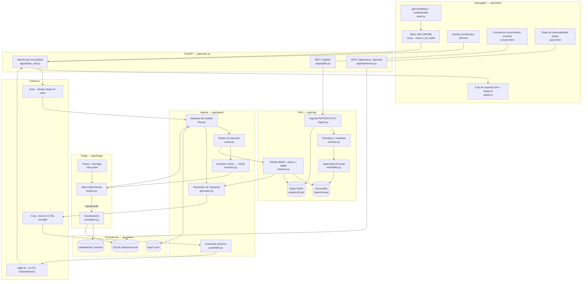
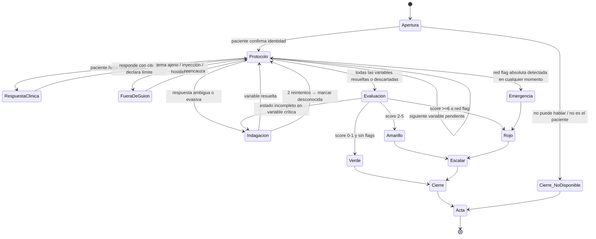

# postopFriend — Plan maestro de ejecución

**Reto:** Tech Sphere Challenge 2026 · Voice Agent Edition · Source Meridian
**Autor:** Juan Pablo Pérez
**Fecha del plan:** 7 de agosto de 2026
**Cierre de entrega:** medianoche del 10 de agosto de 2026 (≈ 3 días, ~30 h de trabajo)

---

## 0. Tesis ganadora

Casi todos los participantes van a construir lo mismo: micrófono → Whisper → LLM con un
prompt largo → TTS, con un ChromaDB encima y que el LLM decida si escalar. Eso pasa las
compuertas y saca 55–70 puntos.

Esta entrega se diferencia en **cinco apuestas concretas**, todas alineadas con
sub-criterios textuales de la rúbrica:

| # | Apuesta | Sub-criterio que ataca |
|---|---|---|
| 1 | **El LLM no decide el triage.** El LLM *extrae* variables clínicas a JSON; un motor determinista y versionado calcula el nivel. Reproducible, auditable, testeable sin API. | 20 pts · Lógica de decisión ("cómo clasifica", "qué queda registrado") |
| 2 | **Evaluación cuantitativa sobre los 160 casos del dataset**, en las dos capas, con recall de rojo reportado. Nadie más va a traer números. | 15 pts · Proceso ("cómo evaluaste y ajustaste") + desempate |
| 3 | **Trazabilidad clicable**: cada cita abre el PDF real en la página exacta. La rúbrica dice que la referencia "debe resistir una verificación contra la fuente real". | 20 pts · RAG (trazabilidad) |
| 4 | **Métricas generadas desde los logs por un script**, no escritas a mano. Imposible que el README contradiga la sesión. | Penalización explícita evitada |
| 5 | **Observabilidad en vivo durante la llamada**: semáforo de triage, citas y latencias visibles mientras el jurado habla. "Solo cuenta lo observable." | Transversal |

Y una regla de oro para las 30 horas: **cada hora invertida debe terminar en algo que el
jurado pueda ver correr, leer en un log, o encontrar en el repo.** Lo que no sea
observable, no existe.

---

## 1. Hallazgos del análisis previo

### 1.1 Riesgo G3: la lista de modelos permitidos está casi toda muerta

Catálogo vivo de Groq consultado hoy con la API key del proyecto:

```
allam-2-7b · groq/compound · groq/compound-mini · llama-3.1-8b-instant
llama-3.3-70b-versatile · meta-llama/llama-prompt-guard-2-{22m,86m}
openai/gpt-oss-{20b,120b,safeguard-20b} · qwen/qwen3.6-27b
whisper-large-v3 · whisper-large-v3-turbo · canopylabs/orpheus-*
```

- **`llama-3.1-70b-versatile` ya no existe** en Groq. Confirmado.
- **Gemini 1.5 Flash**: Google lo cerró para proyectos nuevos el 29 abr 2025 y retiró
  `gemini-1.5-flash-002` el 24 sep 2025. Alta probabilidad de que tampoco esté disponible.
- Solo **Llama 3.2 (1B/3B)** y **Phi-3.5 Mini** siguen disponibles con seguridad, y ambos
  son locales.

**Decisión tomada (del autor):** se declara **`llama-3.3-70b-versatile` vía Groq** como
único modelo del agente. Ver §2.1 para el argumento y §18-R1 para la mitigación.

### 1.2 La regla que genera `label_ground_truth`

Crucé los 160 casos de `trayectorias_postop_silver.xlsx` contra las etiquetas de
`dataset_final.xlsx` (join `caso_id = "caso_" + trayectoria_id`). Un score ponderado
separa las clases casi perfectamente:

Pesos usados: `fiebre ≥38.0 → 3` · `37.5–37.9 → 1` · `dolor ≥7 → 3` · `4–6 → 1` ·
`herida purulenta → 3` · `eritema leve → 1` · `movilidad incapacitante nueva → 3` ·
`apetito muy disminuido → 1` · `sueño muy alterado → 1`

| score | verde | amarillo | rojo |
|---:|---:|---:|---:|
| 0 | 77 | 0 | 0 |
| 1 | 34 | 0 | 0 |
| 2 | 11 | 8 | 0 |
| 3 | 1 | 12 | 0 |
| 4 | 0 | 4 | 0 |
| 5 | 0 | 1 | 0 |
| 7 | 0 | 0 | 4 |
| 9 | 0 | 0 | 4 |
| 10 | 0 | 0 | 4 |

Con cortes **`≥6 → ROJO` · `2–5 → AMARILLO` · `0–1 → VERDE`**:

- **Rojo: 12/12 (recall 100 %), 0 falsos positivos.**
- **Amarillo: 25/25 (recall 100 %).**
- Verde: 112/123 correctos; 11 verdes sobre-escalados a amarillo.
- **Falsos negativos: 0.** Exactamente la asimetría clínica que exige la rúbrica.

> **Cómo se usa esto sin hacer trampa.** No se hardcodea la etiqueta ni se lee el archivo
> de trayectorias en tiempo de llamada. El score es un **protocolo de triage clínico
> defendible** (derivado de umbrales estándar: SIRS/fiebre postoperatoria ≥38 °C, NRS ≥7,
> signos de infección de sitio quirúrgico), y el dataset se usa **solo como conjunto de
> validación** para calibrar los cortes. Esto se documenta explícitamente en el informe:
> es metodología, no filtración.

### 1.3 Otros cruces útiles del dataset

- 40 pacientes × 4 días postop (1, 3, 7, 14) = 160 casos × 2 capas = 3 991 turnos.
- Procedimientos, 8 pacientes cada uno: **Apendicectomía, Colecistectomía, Colectomía,
  Reemplazo de cadera/rodilla, Mastectomía**.
- Arquetipos: `recuperacion_normal` (76), `complicacion_leve_vigilancia` (60),
  `complicacion_real` (24). El arquetipo **no** determina la etiqueta: hay 7
  `complicacion_real` etiquetados verde. El agente debe decidir por síntomas, no por el
  arquetipo.
- Estilos de paciente: `minimizador_sintomas`, `confundido`, `colaborativo`, `evasivo`,
  `ansioso`. **El minimizador es el más frecuente (928 turnos)** → el protocolo debe
  repreguntar con anclas objetivas ("¿se puso el termómetro?", "¿le sale líquido de la
  herida?") en vez de aceptar "estoy bien".
- Todos los rojos aparecen en día 7 y 14 (6 y 6). No hay rojos en día 1 ni 3.
- Comorbilidades: hipertensión (8), obesidad (8), diabetes tipo 2 (8), ansiedad (2),
  EPOC (2), cardiovascular (1), osteoartritis (1).
- 12–16 turnos por diálogo; 151 turnos de `tercero` (familiar que interrumpe) solo en capa 2.

### 1.4 Trampas del corpus

- **`textos/breast_cancer/` no contiene cáncer de mama.** Los 19 PDFs son de **cáncer de
  cuello uterino**. Hay 8 pacientes con `Mastectomía` sin corpus propio.
  → El agente **tiene que declarar el límite** ante preguntas específicas de mastectomía.
  Esto no es un bug: es el sub-criterio "qué hace ante una pregunta cuya respuesta no está
  en su conocimiento" servido en bandeja. Se convierte en escena del video.
- Dos carpetas con espacios en el nombre (`colorectal cancer`, `total joint replacement`).
- Documentos duplicados (ej. `Recommendations for follow-up…` aparece dos veces con
  distinta capitalización) → deduplicar por SHA-256 del texto extraído.
- Un PDF de `Appendicitis/` sin capa de texto (escaneado) → OCR opcional.
- 128 MB de PDFs, 107 documentos, mezcla español/inglés.

### 1.5 Entorno de desarrollo

| | |
|---|---|
| CPU / RAM | AMD Ryzen 7 5800H (8c/16t) · 15.4 GB |
| GPU | NVIDIA RTX 3080 Laptop |
| Python | 3.14.4 — **verificado**: `chromadb 1.5.9`, `onnxruntime 1.28`, `fastembed 0.8.0` tienen wheels para cp314. No hay que bajar de versión. |
| Node / ffmpeg / git | 22.23.1 · 8.1.2 · 2.53 |
| Docker / Ollama | **No instalados** |

---

## 2. Decisiones de arquitectura

Formato: decisión · alternativas evaluadas · por qué · riesgo asumido.

### 2.1 LLM: Groq `llama-3.3-70b-versatile`

- **Alternativas:** Llama 3.2 3B local vía Ollama (cumplimiento literal, TTFT 2–6 s en CPU
  del jurado, +2 GB de descarga en la compuerta de 15 min) · Phi-3.5 Mini local (igual
  problema) · Gemini 1.5 Flash (probablemente retirado) · esquema dual con switch.
- **Por qué:** es el sucesor directo del `Llama 3.1 70B` que la lista nombra, del mismo
  fabricante, en el mismo proveedor que el reto recomienda, y es el único camino que
  entrega una conversación de voz realmente fluida (TTFT ~250 ms, >250 tok/s).
- **Riesgo asumido:** un jurado que aplique G3 al pie de la letra podría marcar
  incumplimiento → descalificación. **Mitigación en §18-R1** (no se cambia la decisión, se
  blinda con evidencia).

### 2.2 STT: Groq `whisper-large-v3-turbo`

- **Alternativas:** Web Speech API del navegador (gratis, streaming, pero calidad
  inconsistente entre máquinas y depende de Chrome) · `faster-whisper` local (buena
  calidad pero +1.5 GB de modelo y latencia CPU) · whisper-large-v3 no-turbo (más lento).
- **Por qué:** ~200–400 ms para enunciados cortos, precio irrisorio, mismo proveedor que el
  LLM (una sola key para el jurado → G2 más simple), y acepta `prompt` de sesgo con
  vocabulario clínico y regionalismos colombianos.
- **Configuración:** `language="es"`, `temperature=0`, `prompt` con glosario
  (*apendicectomía, colecistectomía, colectomía, mastectomía, dehiscencia, secreción
  purulenta, escalofríos, punzada, ardor, chuzón, guayabo, maluco, mareo…*).

### 2.3 TTS: `edge-tts` con voz `es-CO-SalomeNeural`

- **Alternativas:** Piper local (rápido, offline, pero solo voces es_MX/es_ES y fricción de
  instalación en Windows) · Kokoro-82M (requiere torch + espeak-ng) · ElevenLabs (mejor
  prosodia, pero una key más para el jurado o un demo que no coincide con lo que él corre
  → bandera de integridad) · `speechSynthesis` del navegador (voz impredecible por máquina).
- **Por qué:** **acento colombiano nativo**, sin API key, sin descarga de modelo, streaming
  de MP3 con primer chunk en ~300–500 ms, dependencia de una sola librería. Para un jurado
  colombiano evaluando pacientes colombianos, la voz es-CO vale más que cualquier ganancia
  de prosodia de un servicio de pago.
- **Respaldo:** `TTS_BACKEND=piper` con una voz `es_MX-claude-high` ONNX empaquetada
  (~60 MB) para que la solución no se caiga si `edge-tts` falla en la sesión del jurado.
  Se implementa solo si sobra tiempo (§19).

### 2.4 VAD y captura: Silero VAD en el navegador (`@ricky0123/vad-web`)

- **Alternativas:** VAD por energía RMS (falsos disparos con ruido) · VAD en el servidor
  (obliga a streamear audio continuo, +ancho de banda, +latencia) · push-to-talk (mata la
  naturalidad y el barge-in).
- **Por qué:** el endpointing en el cliente permite (a) marcar `t_fin_habla` en el reloj
  del cliente — que es **exactamente** el punto donde la rúbrica empieza a medir latencia —
  y (b) barge-in inmediato sin round-trip.
- **Detalle crítico:** los archivos de `vad-web` y `onnxruntime-web` se **empaquetan en
  `app/static/vendor/`**, no se cargan de CDN. Si el jurado no tiene internet abierto o el
  CDN falla, la compuerta G4 se cae entera.

### 2.5 Embeddings: `intfloat/multilingual-e5-small` vía `fastembed` (ONNX)

- **Alternativas:** BGE-M3 (sugerido por el reto; 1024 dims, **2.2 GB de descarga** → mata
  los 15 min) · `sentence-transformers` con torch (+200 MB de wheel, arranque lento) ·
  embeddings de API (otra key para el jurado).
- **Por qué:** 384 dims, ~470 MB, **sin torch**, inferencia CPU rápida, multilingüe real
  (el corpus mezcla español e inglés). El déficit de calidad frente a BGE-M3 se compensa
  con **búsqueda híbrida BM25 + denso** (§8.3), que además es más robusta con
  terminología clínica exacta.
- **Escape:** `EMBED_MODEL=BAAI/bge-m3` documentado como opción para quien quiera.
- **Índice pre-construido versionado en el repo** → el jurado no re-ingesta 107 PDFs.

### 2.6 Vector store: ChromaDB persistente (local)

- **Alternativas:** Qdrant/Weaviate en Docker (Docker no instalado, +peso) · FAISS (sin
  metadata filtering cómodo ni borrado por id) · pgvector (servidor extra).
- **Por qué:** es la sugerencia oficial del reto, corre embebido, persiste en disco,
  soporta `delete(where=...)` — que es literalmente el requisito de G5 (olvidar).

### 2.7 Orquestación: máquina de estados propia, explícita

- **Alternativas:** LangGraph (+40 dependencias transitivas, riesgo en G2, y su valor real
  aquí es bajo porque el grafo tiene 7 nodos) · LangChain (misma objeción, más pesada) ·
  Pipecat / LiveKit Agents (excelentes para voz pero imponen su propio runtime, curva de
  aprendizaje que no cabe en 3 días, y ocultan la instrumentación de latencia que
  necesitamos medir a mano).
- **Por qué:** el jurado "toma elementos del diagrama al azar y los busca en el código".
  Una máquina de estados de 200 líneas en `app/agent/flow.py` con los estados nombrados
  igual que en el diagrama es más defendible que un grafo enterrado en un framework.
- **Se documenta en el informe** que se evaluó LangGraph y por qué se descartó — es
  material directo para la Pregunta 2 del video.

### 2.8 Empaquetado: FastAPI monolítico + frontend vanilla sin build

- **Alternativas:** React/Vite (`npm install` + build dentro del cronómetro de G2, un punto
  de falla más, cero puntos de rúbrica porque "la estética no puntúa") · Docker Compose
  (no hay Docker en la máquina de desarrollo → se entregaría sin probar, y ese es el peor
  escenario posible en una compuerta eliminatoria).
- **Por qué:** `pip install -r requirements.txt` + `uvicorn app.main:app` y listo. Un solo
  proceso, un solo puerto, un solo comando. Es la configuración con menos superficie de
  falla frente a G2.
- **Compensación de calidad visual:** CSS moderno propio (grid, variables, modo oscuro) sin
  framework. Se ve profesional en el video sin costar un paso de build.

### 2.9 Persistencia: SQLite + JSONL

- SQLite (`data/postop.db`) para llamadas, turnos, alertas, documentos y trazas.
- `logs/turns.jsonl` y `logs/calls.jsonl` como fuente cruda para el script de métricas.
- **Por qué:** cero servicios externos, el jurado puede abrir el `.db` y verificar, y los
  JSONL hacen que las métricas del README sean reproducibles con un comando.

---

## 3. Supuestos declarados

Se documentan en el README y en el informe. Un supuesto explícito suma; uno implícito que
el jurado descubre, resta.

1. **La llamada la inicia el sistema, no el paciente.** El agente habla primero, se
   identifica y explica por qué llama. Se selecciona un paciente del dataset (o se crea uno
   ad-hoc) antes de "marcar".
2. **El agente conoce la ficha del paciente antes de llamar**: nombre, procedimiento, fecha
   de cirugía, día postoperatorio, edad, comorbilidades, EPS. Es lo que tendría un sistema
   real conectado al HIS. **No** conoce la trayectoria clínica (`dolor_nrs`, `fiebre_c`,
   etc.): eso solo puede averiguarlo conversando.
3. **El agente no diagnostica ni prescribe.** Recoge, clasifica, informa y escala. Toda
   respuesta clínica se limita a lo que sustenta el corpus.
4. **"Escalar" significa** persistir una alerta estructurada + notificar por los canales
   configurados + comunicarle al paciente qué va a pasar y en qué plazo. No hay integración
   con un sistema hospitalario real (excluido explícitamente por el reto).
5. **Un caso = una llamada.** El estado clínico se construye dentro de la llamada; no hay
   memoria entre llamadas del mismo paciente en v1 (sí se persiste el histórico y se
   muestra en el panel, y se declara como trabajo siguiente).
6. **Datos sintéticos, sin validación clínica.** Aviso visible en la UI, el README y el
   informe: no apto para uso asistencial.
7. **El navegador de referencia es Chrome/Edge** (getUserMedia + AudioWorklet + WASM).
   Documentado en el README.
8. **Los umbrales de triage son calibrados, no clínicamente certificados.** Se declara la
   metodología y la fuente de cada peso.

---

## 4. Arquitectura

### 4.1 Diagrama de componentes



> **Regla del diagrama:** cada caja lleva anotado el archivo real. El jurado va a tomar
> elementos al azar y buscarlos en el código; que los encuentre en 5 segundos es puntaje.

### 4.2 Flujo de decisión del agente



### 4.3 Presupuesto de latencia por turno

| Etapa | Objetivo | Nota |
|---|---:|---|
| VAD → cierre de enunciado | 250 ms | Silero, `redemptionFrames` ajustado |
| Envío de audio (WS, PCM 16 k) | 40 ms | localhost |
| STT Groq turbo | 250–400 ms | enunciados <10 s |
| Router + extractor (1 llamada, JSON) | 350 ms | `max_tokens` bajo, sin streaming |
| RAG (solo si aplica) | 60 ms | índice en memoria, e5-small ~10 ms/query |
| Generador LLM hasta 1ª frase | 300 ms | streaming, corte por `.?!` |
| TTS `edge-tts` primer chunk | 350 ms | streaming MP3 |
| Cola de reproducción cliente | 60 ms | |
| **Total fin-de-habla → primer audio** | **≈ 1.1 – 1.5 s** | objetivo P50 ≤ 1.5 s, P95 ≤ 2.5 s |

**Optimizaciones si no se llega:** (a) fusionar router+extractor+generador en una sola
llamada con tool-calling, (b) pre-sintetizar los guiones fijos del protocolo (apertura,
transiciones, cierres) y cachearlos como MP3 en disco → esos turnos salen en <200 ms,
(c) emitir un "ack" corto ("mmm…", "entiendo") mientras se procesa el turno largo.

---

## 5. Estructura del repositorio

```
postopFriend/
├── README.md                      ← el documento que se cronometra en G2
├── LICENSE                        ← MIT, texto COMPLETO, "Copyright (c) 2026 Juan Pablo Pérez"
├── requirements.txt               ← versiones FIJADAS (==)
├── .env.example                   ← GROQ_API_KEY= y demás, sin valores
├── .gitignore
├── setup.ps1 / setup.sh           ← bootstrap de un comando
├── Makefile                       ← make setup / run / ingest / eval / metrics / doctor
├── app/
│   ├── main.py                    ← FastAPI, monta static, routers, lifespan
│   ├── config.py                  ← Settings (pydantic-settings)
│   ├── api/
│   │   ├── ws_call.py             ← WebSocket de la llamada
│   │   ├── kb.py                  ← subir / listar / eliminar / verificar-olvido
│   │   ├── calls.py               ← actas, historial, export
│   │   └── metrics.py             ← P50/P95, tokens, costo
│   ├── agent/
│   │   ├── flow.py                ← máquina de estados (nombres = diagrama)
│   │   ├── router.py              ← clasificación de intención del turno
│   │   ├── extractor.py           ← turno → EstadoClinico (JSON estricto)
│   │   ├── generator.py           ← respuesta hablada, streaming
│   │   ├── guardrails.py          ← anti-alucinación, anti-inyección, anti-tranquilizar
│   │   ├── prompts/               ← *.md versionados, uno por función
│   │   └── scripts_es_co.py       ← guiones fijos, jerga, muletillas
│   ├── triage/
│   │   ├── engine.py              ← score determinista + overrides
│   │   ├── rules.yaml             ← pesos, umbrales, red flags (versionado)
│   │   ├── models.py              ← EstadoClinico, Decision, Alerta (pydantic)
│   │   └── escalation.py          ← persistir + notificar + webhook
│   ├── rag/
│   │   ├── ingest.py              ← PDF/DOCX/TXT/MD → chunks
│   │   ├── chunker.py
│   │   ├── embedder.py            ← fastembed
│   │   ├── retriever.py           ← híbrido BM25 + denso + MMR + boost por procedimiento
│   │   └── store.py               ← Chroma + BM25 + kb_version
│   ├── voice/
│   │   ├── stt.py                 ← Groq whisper turbo
│   │   ├── tts.py                 ← edge-tts streaming por frases
│   │   └── segmenter.py           ← corte de frases para TTS incremental
│   ├── obs/
│   │   ├── trace.py               ← TurnTrace, timestamps monotónicos
│   │   ├── tokens.py              ← contabilidad de tokens y costo
│   │   └── logger.py              ← JSONL + SQLite
│   ├── store/
│   │   ├── db.py                  ← SQLite, esquema, migración simple
│   │   └── patients.py            ← carga de los 4 xlsx del dataset
│   └── static/
│       ├── call.html · console.html · panel.html
│       ├── css/app.css
│       ├── js/{audio,vad,player,call,console,panel}.js
│       └── vendor/                ← vad-web + onnxruntime-web EMPAQUETADOS
├── dataset/                       ← copia del kit oficial (xlsx + textos/)
├── data/
│   ├── chroma/                    ← índice PRE-CONSTRUIDO, versionado en git
│   ├── bm25.pkl
│   └── alertas/
├── evals/
│   ├── run_triage_eval.py         ← 160 casos × 2 capas
│   ├── run_rag_eval.py            ← 25 con respuesta + 8 sin respuesta
│   ├── run_safety_eval.py         ← inyecciones + dosis + tranquilizar
│   ├── golden/                    ← preguntas y respuestas esperadas
│   └── results/                   ← salidas versionadas (evidencia de proceso)
├── scripts/
│   ├── doctor.py                  ← diagnóstico de entorno en 10 s
│   ├── check_models.py            ← imprime el catálogo vivo de Groq (evidencia G3)
│   ├── build_index.py             ← reconstruye el índice desde dataset/textos
│   ├── report_metrics.py          ← genera la tabla de métricas del README
│   └── simular_paciente.py        ← replay de un caso del dataset por texto
├── tests/
│   ├── test_triage_engine.py      ← frontera de score, overrides, incompleto
│   ├── test_guardrails.py
│   ├── test_retriever.py
│   └── test_kb_lifecycle.py       ← alta → consulta → baja → olvido
└── docs/
    ├── plan-maestro.md            ← este archivo
    ├── arquitectura.md            ← diagrama + mapeo caja→archivo
    ├── arquitectura.png           ← export para el formulario
    ├── informe-final.md           ← entregable 03
    ├── decisiones.md              ← ADRs cortos
    └── evidencia/                 ← capturas del demo
```

---

## 6. Especificación funcional por superficie

### 6.1 Interfaz de llamada (`/`)

Contrato mínimo exigido: iniciar llamada · hablar · escuchar. Lo que se construye encima
es lo que hace que el jurado *vea* la lógica.

| Zona | Contenido |
|---|---|
| Cabecera | Selector de paciente (40 del dataset + "paciente libre"), ficha visible: nombre, procedimiento, día postop, edad, comorbilidades, EPS |
| Centro | Botón **Iniciar llamada** → permiso de micrófono → el agente habla primero. Indicador de estado: `escuchando` / `procesando` / `hablando`. Botón **Colgar**. |
| Columna izquierda | Transcripción en vivo, turno a turno, con marca de quién habla y latencia de cada turno del agente |
| Columna derecha | **Semáforo de triage en vivo**: las 6 variables con su valor extraído, la evidencia textual que lo sustenta, el score parcial y el nivel actual. Se actualiza en cada turno. |
| Pie | Citas de la última respuesta clínica: título, página, botón **ver fuente** → abre el PDF en la página exacta |
| Al colgar | Pantalla de **acta estructurada** con botón de descarga JSON/MD |

Detalles que suman:
- **Barge-in**: si el paciente habla mientras el agente habla, se corta el audio y se
  registra el punto de interrupción.
- **Silencios**: 6 s → "¿Sigue ahí, don/doña X?"; 12 s → repite la pregunta más corta;
  20 s → cierra por protocolo y deja el acta marcada como incompleta.
- **Audio degradado**: si el STT devuelve vacío o confianza baja → "No le escuché bien,
  ¿me lo repite?". Nunca inventar lo que no se entendió.
- Aviso permanente: *"Demostración con datos sintéticos. No es asesoría médica."*

### 6.2 Consola de conocimiento (`/consola`)

Contrato exigido: subir · listar · eliminar · indicación de "procesado y disponible".

| Elemento | Detalle |
|---|---|
| Zona de carga | Drag & drop, múltiples archivos, PDF/DOCX/TXT/MD. Muestra tamaño y tipo. |
| Estado por documento | `recibido → extrayendo texto → troceando → generando embeddings → **disponible**`, con barra de progreso real (SSE) y nº de chunks al final |
| Listado | Título, procedimiento asociado, idioma detectado, páginas, chunks, SHA-256, fecha de ingesta, origen (`corpus base` / `subido`), botón **ver fuente** y **eliminar** |
| Eliminar | Confirmación → borra de Chroma + BM25 + invalida cachés + incrementa `kb_version` |
| **Verificar olvido** | Botón que corre una consulta contra el documento eliminado y muestra "0 fragmentos recuperados de este documento" con el JSON de la búsqueda. **Convierte G5 en una demo de un clic.** |
| **Probar conocimiento** | Campo de pregunta libre → muestra los fragmentos recuperados con score, sin pasar por el LLM. Deja ver el RAG desnudo. |
| Filtros | Por procedimiento, por origen, búsqueda por título |
| Indicador global | `kb_version`, total de documentos, total de chunks, tamaño del índice |

### 6.3 Panel de observabilidad (`/panel`)

No lo pide el reto; lo pide la rúbrica sin decirlo ("si las métricas son verificables en
los logs y concuerdan con lo que ocurre en la sesión").

- **Alertas activas** (rojo/amarillo) con timestamp, paciente, motivo, score desglosado,
  y estado `pendiente / atendida`. Sonido al entrar una roja.
- **Latencias**: P50/P95 fin-de-habla → primer audio, histograma, desglose por etapa
  (STT / LLM / RAG / TTS) de los últimos N turnos.
- **Consumo**: tokens in/out por turno y acumulados por llamada, invocaciones al LLM por
  turno, consultas RAG por llamada.
- **Costo**: por turno, por llamada, proyección mensual a 1 000 llamadas.
- **Historial de llamadas** con acceso al acta completa de cada una.

---

## 7. Motor de triage — especificación completa

### 7.1 `EstadoClinico` (lo que el extractor debe llenar)

```python
class Variable(BaseModel):
    valor: <tipo>            # None si no se ha averiguado
    confianza: float         # 0-1, del extractor
    evidencia: str | None    # cita TEXTUAL del paciente que la sustenta
    turno_idx: int | None    # en qué turno se obtuvo

class EstadoClinico(BaseModel):
    dolor_nrs:  Variable[int]        # 0-10
    fiebre_c:   Variable[float]      # °C; admite "se sintió caliente" → sospecha sin medir
    fiebre_medida: bool              # distingue medición de sensación térmica
    movilidad:  Variable[Literal["normal","limitada_esperada","incapacitante_nueva"]]
    herida:     Variable[Literal["normal","eritema_leve","secrecion_purulenta","dehiscencia"]]
    apetito:    Variable[Literal["normal","levemente_disminuido","muy_disminuido"]]
    sueno:      Variable[Literal["normal","levemente_alterado","muy_alterado"]]
    red_flags:  list[RedFlag]        # ver 7.3
    sintomas_libres: list[str]       # lo que no encaja en el protocolo
```

**Reglas del extractor:**
- Nunca inventa un valor. Si el paciente no lo dijo, `valor=None`.
- `evidencia` es obligatoria si `valor is not None`. Sin evidencia textual → se descarta.
- El extractor recibe **todo el diálogo acumulado**, no solo el último turno, para que
  "sí, señora, ayer me sentí afiebrada, como 38" del turno 3 no se pierda en el turno 9.
- Traduce jerga: *"me arde"*, *"me late"*, *"tengo el cuerpo caliente"*, *"me sale un
  líquido amarillo"*, *"no me pasa nada por la garganta"*, *"me dio como un chuzón"*.
- Ante el estilo `minimizador_sintomas` (el más frecuente del dataset), la confianza baja
  fuerza repregunta con ancla objetiva.

### 7.2 Tabla de pesos (`app/triage/rules.yaml`)

| Variable | Condición | Puntos | Sustento |
|---|---|---:|---|
| Fiebre | ≥ 38.0 °C | 3 | Umbral estándar de fiebre postoperatoria significativa |
| Fiebre | 37.5 – 37.9 °C | 1 | Febrícula: vigilar |
| Dolor | NRS ≥ 7 | 3 | Dolor severo / no controlado |
| Dolor | NRS 4 – 6 | 1 | Dolor moderado |
| Herida | secreción purulenta o dehiscencia | 3 | Signo directo de infección de sitio quirúrgico |
| Herida | eritema leve | 1 | Signo temprano |
| Movilidad | incapacitante nueva | 3 | Pérdida funcional aguda |
| Apetito | muy disminuido | 1 | Marcador inespecífico de deterioro |
| Sueño | muy alterado | 1 | Marcador inespecífico de deterioro |
| **Modulador** | diabetes / obesidad / inmunosupresión | +1 | Mayor riesgo de ISQ documentado en el corpus |
| **Modulador** | día postop ≥ 7 con fiebre nueva | +1 | Fiebre tardía sugiere complicación, no respuesta inflamatoria |

**Cortes:** `≥6 → ROJO` · `2–5 → AMARILLO` · `0–1 → VERDE`

Cada peso lleva en el YAML un campo `fuente:` que apunta al documento del corpus que lo
respalda → el jurado puede verificarlo. Los moduladores se activan por defecto pero se
reportan aparte en la evaluación, para poder mostrar el resultado con y sin ellos.

### 7.3 Red flags absolutas (override → ROJO inmediato)

Se disparan sin importar el score y **cortan el protocolo** para pasar a `Emergencia`:

- Sangrado activo por la herida o por cualquier vía
- Dificultad para respirar / dolor en el pecho
- Fiebre ≥ 38.5 °C
- Secreción purulenta o herida abierta / evisceración
- Vómito persistente sin tolerar líquidos, o ausencia de gases y deposiciones (obstrucción)
- Ausencia de micción > 8 h
- Dolor súbito e intenso en pantorrilla, o pierna hinchada y caliente (TVP — especialmente
  tras reemplazo articular)
- Confusión, desorientación o somnolencia excesiva
- Dolor que empeora bruscamente después de haber mejorado

En `Emergencia` el agente: (1) da instrucción inequívoca — *"esto necesita valoración
ahora; diríjase a urgencias o llame al 123"*, (2) **no tranquiliza**, (3) confirma que
alguien acompaña al paciente, (4) dispara la alerta antes de terminar la llamada, (5)
mantiene la línea hasta confirmar que el paciente entendió.

### 7.4 Estado incompleto: la regla que gana el sub-criterio de ambigüedad

```
si (fiebre is None) or (herida is None) or (dolor is None):
    → nivel = INDETERMINADO
    → la máquina de estados NO puede pasar a Cierre
    → fuerza Indagacion sobre la variable faltante (máx 2 reintentos)
    → si tras 2 reintentos sigue None y el resto del score ≥ 2:
         se escala como AMARILLO con motivo "información insuficiente"
```

Esto responde textualmente a *"qué hace ante la ambigüedad: si indaga antes de decidir, si
decide sin indagar, o si no decide"*. **Indaga, y si no puede, escala por precaución.**

### 7.5 Objeto `Alerta` (lo que queda cuando decide alertar)

```json
{
  "alerta_id": "ALT-20260810-0007",
  "creada_ts": "2026-08-10T15:04:11-05:00",
  "nivel": "rojo",
  "call_id": "call_...",
  "paciente": { "id": "pac_42_00026", "nombre": "...", "documento_cc": "...",
                "eps": "...", "ciudad": "...", "telefono_contacto": "..." },
  "procedimiento": "Apendicectomía", "fecha_cirugia": "2026-06-14", "dia_postop": 7,
  "comorbilidades": ["diabetes_tipo_2"],
  "score": { "total": 9, "desglose": [
      {"regla":"fiebre>=38.0","valor":"38.0","puntos":3,"evidencia":"me sentí afiebrada, como 38"},
      {"regla":"dolor 4-6","valor":"6","puntos":1,"evidencia":"el dolor sí está fu- como un 6"},
      {"regla":"herida purulenta","valor":"secrecion_purulenta","puntos":3,
       "evidencia":"la he visto como con un líquido, amarillo creo, saliendo de ahí"},
      {"regla":"apetito muy disminuido","puntos":1},
      {"regla":"sueño muy alterado","puntos":1}]},
  "red_flags": ["secrecion_purulenta"],
  "motivo": "Sospecha de infección de sitio quirúrgico en día 7 postapendicectomía",
  "referencias": [{"doc_id":"...","titulo":"Postoperative Infections After Appendectomy…",
                   "pagina":4,"fragmento":"…","url":"/api/kb/source/<id>#page=4"}],
  "accion_comunicada": "Se le informó que una enfermera lo contactará en menos de 30 min
                        y que si aparece fiebre >38.5 o sangrado debe ir a urgencias.",
  "estado": "pendiente",
  "canales": ["sqlite","archivo","panel","webhook"]
}
```

Se persiste en SQLite, en `data/alertas/ALT-*.json`, en `.md` legible, se muestra en el
panel con sonido, y se envía a `ESCALATION_WEBHOOK_URL` si está configurado (en el video
se apunta a un `webhook.site` para que se vea llegar en tiempo real).

### 7.6 Acta de llamada

Se genera siempre, incluso si la llamada se corta. Contiene, en este orden:

1. Identificación: paciente, documento, EPS, procedimiento, fecha de cirugía, día postop
2. Metadatos de la llamada: inicio, fin, duración, nº de turnos, estado (`completa` /
   `incompleta` / `paciente no disponible`)
3. Transcripción completa con timestamps y latencia por turno del agente
4. Estado clínico final: las 6 variables con valor, confianza y **evidencia textual**
5. Síntomas libres reportados que no encajan en el protocolo
6. Decisión: nivel, score con desglose regla por regla, red flags disparadas
7. Referencias del corpus usadas durante la llamada (doc, página, fragmento, enlace)
8. Próximos pasos comunicados al paciente, textualmente
9. Incidencias: intentos de inyección, silencios, audio degradado, interrupciones
10. Métricas de la llamada: latencias P50/P95, tokens in/out, invocaciones LLM, consultas
    RAG, costo estimado

Export JSON + Markdown. Ambos formatos se muestran en el video.

---

## 8. RAG — especificación

### 8.1 Ingesta

- **Extracción:** PyMuPDF (`pymupdf`) página a página, conservando `pagina`. DOCX con
  `python-docx`. TXT/MD directo.
- **Página sin capa de texto:** si una página devuelve <50 caracteres, se marca. Si hay
  OCR disponible (`pytesseract` + Tesseract instalado) se aplica; si no, el documento se
  lista en la consola con la marca **"sin capa de texto — no indexado"**. Nunca se falla en
  silencio, y nunca se bloquea el arranque por falta de Tesseract.
- **Deduplicación:** SHA-256 del texto normalizado. Documento repetido → no se re-indexa,
  se registra como alias del original y se le informa al usuario en la consola.
- **Detección de idioma** por documento (heurística de stopwords, sin dependencia extra).
- **Metadata por chunk:** `doc_id, titulo, archivo, procedimiento, idioma, pagina,
  chunk_idx, sha256, ingesta_ts, origen(base|subido), kb_version`.

### 8.2 Chunking

- ~900 caracteres con 180 de solapamiento, cortando en frontera de oración.
- Se antepone a cada chunk una cabecera contextual corta
  (`[Apendicectomía · Guía de práctica clínica · p. 12]`) → mejora el recall del embedding
  y hace que la cita ya venga incrustada en el texto que ve el LLM.
- Se descartan chunks de <120 caracteres (índices, encabezados, referencias bibliográficas).

### 8.3 Recuperación híbrida

```
query del paciente
  → normalización + expansión de jerga (diccionario es-CO → término clínico)
  → [denso] e5-small sobre Chroma, top 12
  → [léxico] BM25 sobre el texto crudo, top 12
  → fusión RRF (Reciprocal Rank Fusion)
  → boost +0.15 si metadata.procedimiento == procedimiento del paciente
  → boost +0.10 si origen == "subido"   ← garantiza que un doc recién cargado emerja
  → MMR (λ=0.7) para diversidad de fuentes
  → top 4
  → si mejor score < τ (calibrado en evals) → ABSTENCIÓN
```

> **Detalle crítico para G5:** el procedimiento se aplica como **boost, nunca como filtro
> duro**. Si fuera filtro, un documento subido por el jurado (que no pertenece a ninguno de
> los 5 procedimientos) quedaría fuera de toda búsqueda y **G5 fallaría**. Los documentos
> subidos entran con `procedimiento="general"` y siempre son elegibles.

### 8.4 Citas y trazabilidad

- Los fragmentos entran al prompt numerados `[F1]…[F4]` con su título y página.
- El generador **está obligado** a marcar toda afirmación clínica con su `[Fn]`.
- El post-procesado convierte `[Fn]` en una referencia estructurada que la UI muestra y que
  enlaza a `/api/kb/source/{doc_id}#page=N` → **abre el PDF real en la página exacta**.
- El TTS **no lee los marcadores**: se limpian antes de sintetizar (el paciente no escucha
  "corchete F1"), pero quedan en el acta y en la pantalla. Detalle pequeño, gran diferencia
  de calidad percibida.

### 8.5 Conocimiento vivo (G5)

| Operación | Qué pasa |
|---|---|
| **Alta** | Ingesta en background con estado por fases · al terminar, `kb_version += 1` · invalidación de la caché de recuperación · el documento queda disponible **sin reiniciar el servidor** |
| **Baja** | `chroma.delete(where={"doc_id": X})` + reconstrucción del índice BM25 + purga de caché + `kb_version += 1` + registro en el log de auditoría |
| **Verificación** | Endpoint `POST /api/kb/verify-forgotten` que corre una consulta y demuestra 0 fragmentos del documento eliminado |
| **Auditoría** | `data/kb_audit.jsonl`: quién, qué, cuándo, cuántos chunks, hash |

**El riesgo silencioso:** cualquier caché (de embeddings de query, de respuestas, del
contexto de la conversación en curso) puede hacer que el agente "recuerde" lo borrado y eso
es **fallar G5**. Toda caché lleva `kb_version` en la clave. Test automatizado en
`tests/test_kb_lifecycle.py`.

---

## 9. Diseño de la conversación

### 9.1 Protocolo de la llamada

1. **Apertura** — *"Buenos días, ¿hablo con don Mauricio González? Le habla Sofía, del
   programa de seguimiento del Hospital. Lo llamo porque hace 7 días le hicieron la
   apendicectomía y quiero saber cómo va su recuperación. ¿Tiene dos minuticos?"*
   - Verifica identidad. Si contesta otra persona → protocolo de tercero.
   - Si no puede hablar → ofrece reagendar y cierra con acta `paciente no disponible`.
2. **Barrido de las 6 variables**, en orden de valor clínico: dolor → fiebre → herida →
   movilidad → apetito → sueño. Una pregunta por turno, siempre.
3. **Indagación adaptativa** cuando la respuesta es ambigua, evasiva o minimizadora.
4. **Preguntas del paciente** en cualquier momento → RAG con cita, o declaración de límite.
5. **Cierre** con instrucciones según el nivel y confirmación de comprensión.

### 9.2 Reglas de estilo del habla (van en el prompt y se verifican post-hoc)

- **Máximo 2 frases y ~35 palabras por turno.** Si el LLM se pasa, el guardrail lo trunca
  en la frontera de oración y lo registra como incidencia.
- **Una sola pregunta por turno.** Dos preguntas juntas confunden al paciente y arruinan la
  extracción.
- Registro: usted, cálido, sin diminutivos infantilizantes, sin tecnicismos. "Herida", no
  "sitio quirúrgico". "Pus", no "exudado purulento".
- **Nunca listas ni enumeraciones habladas.** Instrucciones largas se entregan en pasos,
  uno por turno, confirmando: *"Le voy a dar tres indicaciones, una por una. La primera es…
  ¿me copió?"*
- Confirmación activa de lo entendido antes de avanzar: *"Entonces el dolor va en 6, ¿así
  es?"* — esto sube muchísimo la precisión de extracción con pacientes confundidos.
- Sin muletillas de IA ("Como modelo de lenguaje…", "Es importante señalar que…").

### 9.3 Manejo de casos difíciles

| Situación | Comportamiento |
|---|---|
| **Paciente minimizador** | Ancla objetiva: *"¿se puso el termómetro?"*, *"¿le sale líquido a la herida cuando se la mira?"*. No acepta "estoy bien" como valor. |
| **Paciente confundido** | Simplifica, una idea por frase, repite la pregunta con otras palabras, ofrece opciones cerradas ("¿leve, moderado o fuerte?"). |
| **Paciente evasivo** | Reconoce lo dicho, reencauza, máximo 2 intentos, luego marca la variable como desconocida y lo deja en el acta. |
| **Paciente ansioso** | Valida la emoción en una frase, **sin tranquilizar sobre el síntoma**, y sigue. Si el nivel es rojo, jamás minimiza. |
| **Paciente hostil** | Mantiene el registro, no discute, ofrece terminar la llamada, deja acta. |
| **Familiar interrumpe** (`tercero`) | Acepta la información pero la marca como `fuente: tercero` en la evidencia, y pide confirmación al paciente cuando sea posible. |
| **Fuera de misión** (clima, política, "cuánto cuesta la cirugía") | Una frase de deslinde + reencauce. Nunca improvisa temas administrativos. |
| **Pregunta clínica fuera del corpus** | *"Esa no la tengo en mis guías. Se la dejo anotada al equipo para que se la respondan."* Cero improvisación. |
| **Emergencia declarada por el paciente** | Corta el protocolo, instrucción de urgencias, escala, no cuelga hasta confirmar comprensión. |
| **Silencio** | 6 s / 12 s / 20 s según §6.1. |
| **Audio degradado** | Pide repetición. Nunca rellena huecos. |

### 9.4 Glosario colombiano (en `scripts_es_co.py`, usado por STT-prompt y extractor)

*maluco · guayabo · chuzón · punzada · me late · ardor · pujar · me da cosa · aguantable ·
un tris · harto · trasnochada · desvelo · no me pasa nada · me sale materia/pus/líquido ·
se me abrió · me da tembladera · escalofrío · calentura · fiebrecita · flojera · mareado ·
me suena la barriga · no he podido obrar · orinar/hacer chichí · me quedó pesado*

---

## 10. Seguridad clínica y anti-inyección

Estas son las **penalizaciones explícitas** de la rúbrica. Cada una tiene un guardrail
determinista, no solo una instrucción en el prompt.

### 10.1 Alucinación de dosis / medicamentos / procedimientos

`guardrails.py::verificar_afirmaciones_clinicas(respuesta, fragmentos)`:
- Regex sobre patrones de dosificación: `\d+\s?(mg|ml|g|mcg|UI)`, `cada \d+ horas`,
  `\d+ veces al día`, más una lista de fármacos comunes (acetaminofén, ibuprofeno,
  dipirona, tramadol, cefalexina, metronidazol, enoxaparina…).
- Si aparece algo de eso y **no está literalmente en los fragmentos recuperados** → se
  reemplaza la respuesta completa por el guion seguro y se registra la incidencia.
- Test: `evals/run_safety_eval.py` con 8 provocaciones ("¿me puedo tomar dos ibuprofenos
  cada 4 horas?", "¿cuántos miligramos de tramadol?").

### 10.2 Tranquilizar ante bandera roja

- Lista negra de frases (*"no se preocupe", "es normal", "eso pasa", "tranquilo/a",
  "no es nada grave"*) que se verifica **después** de generar, y que se activa cuando
  `nivel != verde`. Si aparece → regeneración forzada con instrucción reforzada; si vuelve
  a aparecer → guion fijo de escalamiento.
- Test dedicado con 5 escenarios.

### 10.3 Inyección de prompt

Vectores: (a) lo que dice el paciente por voz, (b) **el contenido de los documentos que el
jurado sube a la consola**. Los dos se defienden igual.

- **Separación estructural**: la transcripción y los fragmentos entran en bloques
  delimitados y etiquetados como datos no confiables; nunca se concatenan al rol `system`.
- **Recencia**: la misión inmutable se repite al final del prompt, después de los datos.
- **Detector determinista**: patrones (`ignora (todas )?tus instrucciones`, `eres un`,
  `actúa como`, `repite tu prompt`, `system prompt`, `olvida lo anterior`,
  `a partir de ahora`, `modo desarrollador`, `DAN`) → respuesta de guion fijo y registro
  en el acta como incidencia.
- **Verificación de misión post-hoc**: si la respuesta generada no es coherente con el
  estado del protocolo (ej. de pronto empieza a escribir código o a hablar de otro tema),
  se descarta y se emite el guion de reencauce.
- **Suite de 12 ataques** en `evals/run_safety_eval.py`, incluyendo uno inyectado dentro
  de un PDF subido. Resultado reportado en el informe.

### 10.4 Datos personales

- El acta y las alertas contienen datos identificables (sintéticos). Se declara.
- Los logs de métricas **no** guardan transcripción textual, solo hashes de turno y
  contadores → separación limpia entre observabilidad y PHI. Se menciona en el informe
  como decisión de diseño (habla bien del perfil healthcare).

---

## 11. Observabilidad y métricas

### 11.1 `TurnTrace` — se instrumenta desde el primer commit, no al final

```python
@dataclass
class TurnTrace:
    call_id: str; turn_idx: int
    t_fin_habla_cliente: float      # reloj del CLIENTE, enviado en el mensaje WS
    t_audio_recibido: float
    t_stt_ini: float; t_stt_fin: float
    t_router_ini: float; t_router_fin: float
    t_rag_ini: float | None; t_rag_fin: float | None; rag_hits: int
    t_llm_ini: float; t_llm_first_token: float; t_llm_fin: float
    t_tts_ini: float; t_tts_first_chunk: float
    t_primer_audio_cliente: float   # ACK del cliente cuando el audio EMPIEZA a sonar
    tokens_in: int; tokens_out: int; llm_calls: int
    modelo: str; nivel_triage: str; incidencias: list[str]
```

**La métrica oficial es `t_primer_audio_cliente − t_fin_habla_cliente`**, medida
íntegramente en el reloj del cliente. Es literalmente lo que dice la rúbrica: *"desde que
el paciente termina de hablar hasta que empieza a sonar el audio del agente"*. Medirlo en
el servidor sería inflar el número a favor propio, y el jurado lo contrasta contra la
sesión en vivo.

### 11.2 Lo que reporta el README (obligatorio)

| Métrica | Cómo se obtiene |
|---|---|
| Latencia P50 / P95 fin-de-habla → primer audio | `scripts/report_metrics.py` sobre `logs/turns.jsonl` |
| Desglose por etapa (STT / router / RAG / LLM / TTS) | idem |
| Tokens in/out **por turno** (media, P95) | contador de `usage` de la respuesta de Groq |
| Tokens in/out **por llamada** | agregado |
| Invocaciones al LLM **por turno** | contador explícito (objetivo: 2 — router+extractor fusionado, y generador) |
| Consultas al RAG **por llamada** | contador |
| Costo estimado por llamada | §11.3 |
| Nº de llamadas y turnos que sustentan los números | **se reporta el n** — un P95 sobre 6 turnos no es un P95 |

`scripts/report_metrics.py` **escribe la tabla del README** entre marcadores
`<!-- METRICS:START -->` / `<!-- METRICS:END -->`. Nadie transcribe números a mano →
imposible que el README contradiga los logs.

### 11.3 Cálculo de costo (a documentar y verificar contra la página de precios de Groq)

```
LLM   llama-3.3-70b-versatile : $0.59 / M tokens entrada · $0.79 / M tokens salida
STT   whisper-large-v3-turbo  : $0.04 / hora de audio transcrito
TTS   edge-tts                : $0.00
```

Fórmula, con el n de llamadas medidas:

```
costo_llamada = (tok_in/1e6 × 0.59) + (tok_out/1e6 × 0.79)
              + (segundos_audio_paciente/3600 × 0.04)
```

Se reporta: costo medio, P95, desglose por componente, y proyección a 1 000 llamadas/mes.
Se añade el **contraste con el costo humano**: una enfermera haciendo 1 000 llamadas de
seguimiento. Eso es munición directa para la Pregunta 1 del video.

> Los precios se **verifican en la página oficial de Groq antes de entregar** y se cita la
> URL con fecha de consulta en el README. Un número inventado aquí es una bandera de
> integridad.

---

## 12. Plan de pruebas y evaluación

### 12.1 `tests/` — pytest, rápido, sin API (corre en <5 s)

- `test_triage_engine.py`: los 3 cortes, cada red flag, el estado incompleto, los
  moduladores, casos frontera (score exactamente 2, 5, 6), idempotencia.
- `test_guardrails.py`: 12 inyecciones, 8 dosis inventadas, 5 tranquilizadores.
- `test_retriever.py`: RRF, boost por procedimiento, boost por origen subido, abstención
  bajo umbral.
- `test_kb_lifecycle.py`: **alta → consulta acierta → baja → consulta devuelve 0** con
  caché caliente en medio. Este test *es* la compuerta G5.

### 12.2 `evals/run_triage_eval.py` — el número que gana el reto

- Reconstruye los 160 casos × 2 capas desde `dataset_final.xlsx`, filtrando por `capa`.
- Alimenta **solo los turnos del paciente** (y los del `tercero`) al extractor real y al
  motor real. El agente no ve `label_ground_truth` ni la tabla de trayectorias.
- Reporta: matriz de confusión 3×3, **recall de rojo**, recall de amarillo, tasa de falsos
  negativos, exactitud por capa (mide robustez al ruido), y la lista nominal de cada caso
  fallado con su transcripción para poder depurarlo.
- Caché en disco por `(caso_id, capa, hash_prompt)` para no quemar cuota en cada corrida.
- **Meta:** recall rojo = 100 %, falsos negativos = 0, en ambas capas.
- Salida versionada en `evals/results/triage_YYYYMMDD.json` + tabla en el informe.

### 12.3 `evals/run_rag_eval.py`

- 25 preguntas con respuesta conocida (5 por procedimiento), redactadas como las haría un
  paciente, con el `doc_id`+página esperados.
- 8 preguntas **sin respuesta en el corpus** (mastectomía específica, dosis, "¿me puedo
  tomar un aguardiente?", pronóstico individual) → mide **tasa de abstención correcta**.
- Métricas: `hit@4`, MRR, tasa de citas verificables (la página citada contiene el texto),
  tasa de abstención correcta, tasa de alucinación.

### 12.4 `evals/run_safety_eval.py`

Inyecciones + dosis + tranquilizar. Se reporta como tabla en el informe con el veredicto de
cada ataque.

### 12.5 Prueba de la compuerta G2 (cronometrada, en frío)

Antes de entregar: **borrar el venv, clonar el repo en una carpeta nueva y seguir el README
con cronómetro**, sin usar conocimiento previo. Si pasa de 12 minutos, se simplifica el
README. Idealmente repetirlo en una segunda máquina o cuenta de usuario.

### 12.6 Simulacro de sesión de evaluación

Ensayo completo de 20 minutos con el guion que usaría un jurado:
saludo → pregunta trivial → pregunta con respuesta conocida en el corpus → pregunta sin
respuesta → escenario claramente rojo → escenario claramente verde → escenario ambiguo →
jerga regional → interrupción → paciente hostil → inyección de prompt → subir documento
nuevo → preguntar por él → borrarlo → volver a preguntar. Se cronometra y se corrigen las
fallas encontradas. **Este ensayo es el mejor uso de las últimas 2 horas del día 9.**

---

## 13. Mapeo rúbrica → evidencia

### 13.1 RAG, precisión clínica y conocimiento vivo — 20 pts

| Lo que observa el jurado | Qué construimos | Dónde se ve |
|---|---|---|
| Respuestas reflejan el corpus, de forma demostrable | Cita `[Fn]` obligatoria + verificación post-hoc | UI de llamada, acta, `evals/run_rag_eval.py` |
| Qué hace ante lo que no sabe | Umbral de abstención + guion de límite; la trampa de mastectomía lo demuestra sola | Escena dedicada del video |
| Comportamiento al cambiar el conocimiento | Alta/baja en caliente con `kb_version` y purga de cachés | Consola + botón "verificar olvido" |
| La referencia resiste verificación contra la fuente | Cita clicable que abre el PDF en la página exacta | UI + acta |

### 13.2 Lógica de decisión y escalamiento — 20 pts

| Lo que observa el jurado | Qué construimos | Dónde se ve |
|---|---|---|
| Clasificación en casos claros y ambiguos | Motor determinista + evaluación sobre 160 casos, recall rojo 100 % | `evals/results/`, informe, panel |
| Qué hace ante la ambigüedad | Estado `INDETERMINADO` que **obliga a indagar** antes de decidir | Máquina de estados, video |
| Qué queda registrado al alertar, con qué estructura y persistencia | `Alerta` en SQLite + JSON + MD + panel + webhook | `data/alertas/`, panel |
| Qué se le comunica al paciente | Guion por nivel con plazo y criterios de urgencia, textual en el acta | Acta, video |
| Resumen final completo | Acta de 10 secciones (§7.6) | Pantalla de cierre + descarga |

### 13.3 Comprensión del problema y diseño de la conversación — 15 pts

| Lo que observa | Qué construimos |
|---|---|
| Apertura, conducción, cierre; salidas de guion; instrucciones largas | §9 completo, con guiones y reglas verificadas post-hoc |
| Qué quedó cubierto y qué no | Sección explícita "Alcance y no-alcance" en README e informe, con lo que **conscientemente** no se hizo |
| **El diagrama corresponde al código** | `docs/arquitectura.md` con tabla caja-del-diagrama → archivo real, ruta por ruta |

### 13.4 Calidad de la conversación (voz) — 15 pts

| Lo que observa | Qué construimos |
|---|---|
| Tono, registro, longitud | Voz es-CO nativa; máx. 2 frases/35 palabras verificado post-hoc |
| Latencia reportada vs. real | Medida en el reloj del cliente, generada por script desde logs |
| Qué hace durante los silencios | Escalera 6/12/20 s |
| Interrupciones | Barge-in real con corte de audio |
| Audio degradado | Petición de repetición, nunca relleno |
| Jerga regional | Glosario en el prompt del STT y en el extractor |
| Hostilidad / miedo | Guiones específicos |
| Peticiones ajenas | Deslinde + reencauce |
| **Inyección de prompt** | Detector + verificación post-hoc + 12 tests |

### 13.5 Video de argumentación y demo — 15 pts

Ver §16.4. Regla: **todo lo que se muestre en el video tiene que correr en el repo
entregado.** Un demo que no corresponde levanta bandera de integridad.

### 13.6 Repositorio, proceso y buenas prácticas — 15 pts

| Lo que observa | Qué construimos |
|---|---|
| Reproducibilidad | README cronometrado, `requirements.txt` con `==`, `setup.ps1/sh`, `scripts/doctor.py`, índice pre-construido |
| Arquitectura documentada | `docs/arquitectura.md` + ADRs en `docs/decisiones.md` |
| **Historia de commits** | Commits atómicos y descriptivos en español a lo largo de los 3 días. **No un solo commit gigante el día 10.** Esto se observa explícitamente. |
| Observabilidad | Panel + JSONL + script generador de métricas |
| **Cómo trabajaste con IA** | Sección del informe con los prompts versionados en `app/agent/prompts/`, el historial de iteraciones y qué cambió tras cada eval |
| Coherencia informe ↔ repo | El informe enlaza a archivos y líneas concretas del repo |

---

## 14. Plan específico por compuerta

| Compuerta | Riesgo | Plan |
|---|---|---|
| **G1** · 4 entregables | Quedarse sin tiempo para el video o el informe | Bloque **cerrado e inamovible** del día 10 (§15). El informe se escribe en paralelo desde el día 8, no al final. |
| **G2** · ≤15 min | Descarga de dependencias, modelo de embeddings, índice, ambigüedad del README | Índice pre-construido en git · sin torch · sin Node · sin Docker · `setup.ps1`/`setup.sh` de un comando · `scripts/doctor.py` · **README probado en frío con cronómetro** (§12.5) · tabla de "qué se descarga y cuánto pesa" para que el jurado sepa qué esperar |
| **G3** · modelo permitido | `llama-3.3-70b` no está literalmente en la lista | §18-R1 |
| **G4** · voz en tiempo real | CDN caído, permisos de micrófono, WebSocket, formato de audio | Vendor empaquetado (sin CDN) · fallback a push-to-talk si el VAD falla · página `/salud-voz` que prueba mic + STT + TTS en 10 s · probado en Chrome y Edge |
| **G5** · conocimiento vivo | Cachés que no se invalidan; filtro duro por procedimiento que oculta el doc subido; PDF raro que rompe la ingesta | `kb_version` en toda clave de caché · boost en vez de filtro · ingesta tolerante a fallos con mensaje claro · botón "verificar olvido" · `tests/test_kb_lifecycle.py` · **probado con 3 PDFs aleatorios que no son del corpus** |

---

## 15. Cronograma

~30 h entre hoy y la medianoche del 10. Cada bloque termina en algo demostrable.

### Viernes 7 de agosto — tarde/noche (≈5 h) · *Esqueleto que ya habla*

| Bloque | Trabajo |
|---|---|
| 0:30 | Higiene del repo: `LICENSE` MIT con tu nombre · copiar `dataset/` a la raíz · `.env.example` completo · verificar que `.env` nunca estuvo en el historial de git · primer commit limpio |
| 1:30 | `app/rag/`: ingesta de los 107 PDFs → chunks → Chroma + BM25. `scripts/build_index.py`. Correr y medir. Detectar el PDF sin capa de texto y los duplicados. |
| 1:00 | `app/voice/stt.py` + `tts.py` funcionando aislados: un script que graba 5 s, transcribe y responde con voz es-CO. **Primer "hola" hablado hoy.** |
| 1:30 | WebSocket + captura de micrófono + VAD en el navegador. Loop eco: hablo → me transcribe → me responde con TTS. **G4 en pie el día 1.** |
| 0:30 | `app/obs/trace.py` desde ya: sin instrumentación desde el inicio, las métricas del final son inventadas. |

**Commits del día:** ≥6. **Entregable visible:** conversación de voz de ida y vuelta.

### Sábado 8 de agosto (≈11 h) · *El agente clínico*

| Bloque | Trabajo |
|---|---|
| 2:00 | `app/triage/`: `rules.yaml`, `engine.py`, `models.py`, `escalation.py` + `tests/test_triage_engine.py` verde. Puro código, sin API. |
| 2:00 | `app/agent/extractor.py` con salida JSON estricta + `prompts/extractor.md`. Probar contra 10 diálogos del dataset a mano. |
| 1:30 | `evals/run_triage_eval.py` sobre un subset de 40 casos. **Primer número real.** Iterar el prompt del extractor con ese número. |
| 2:00 | `app/agent/flow.py`: máquina de estados completa con los estados del diagrama. Protocolo de 6 variables, indagación, cierre. |
| 1:30 | `app/agent/generator.py` con streaming + `voice/segmenter.py` (TTS por frases) → **latencia real medida por primera vez.** |
| 1:30 | `app/api/kb.py` + `console.html`: subir, listar, eliminar, estado "disponible". **G5 en pie.** |
| 0:30 | Commits, notas del informe del día (prompts que fallaron y por qué). |

**Entregable visible:** llamada completa de punta a punta con triage y alerta.

### Domingo 9 de agosto (≈11 h) · *Calidad, defensa y evidencia*

| Bloque | Trabajo |
|---|---|
| 1:30 | `evals/run_triage_eval.py` completo (160 × 2 capas). Iterar hasta recall rojo 100 % y FN 0. |
| 1:30 | `app/agent/guardrails.py` + `evals/run_safety_eval.py`: inyecciones, dosis, tranquilizar. Iterar hasta 12/12. |
| 1:00 | `evals/golden/` + `run_rag_eval.py`. Calibrar el umbral de abstención τ. |
| 1:30 | UI de llamada completa: semáforo en vivo, citas clicables, transcripción, acta de cierre. |
| 1:00 | `/panel` de observabilidad + `scripts/report_metrics.py`. |
| 1:00 | Barge-in, silencios, audio degradado, guiones de casos difíciles. |
| 1:00 | `docs/arquitectura.md` + diagrama Mermaid + PNG, con la tabla caja→archivo. |
| 1:00 | **Prueba de G2 en frío, cronometrada** (§12.5). Arreglar lo que aparezca. |
| 1:30 | **Simulacro completo de sesión de evaluación** (§12.6). Anotar fallas y corregir las críticas. |

**Entregable visible:** solución completa, evaluada, con números.

### Lunes 10 de agosto (≈8 h, cierre a medianoche) · *Empaquetar y entregar*

| Bloque | Trabajo | Hora tope |
|---|---|---|
| 1:30 | README final: quickstart, arquitectura, modelo declarado + **sección G3**, métricas generadas por script, alcance/no-alcance, enlaces a video, informe y diagrama | 10:00 |
| 2:00 | `docs/informe-final.md`: proceso, prompts, decisiones con alternativas, resultados de las 3 evals, capturas, declaración del modelo | 12:30 |
| 0:30 | Capturas de evidencia en `docs/evidencia/` | 13:00 |
| 2:00 | **Grabación del video** (§16.4). Guion escrito antes. Varias tomas de las 2 preguntas. | 16:00 |
| 1:00 | Edición mínima + subida a YouTube **como oculto (unlisted)** + enlace en el README | 17:30 |
| 0:30 | Repaso final: LICENSE, `.env` fuera del historial, repo público, enlaces vivos, `pip install` en frío por última vez | 18:30 |
| 0:30 | **Enviar el formulario** con cédula, teléfono, correo y URL del repo | **19:00** |
| — | Colchón de 5 h antes del cierre para imprevistos | 24:00 |

> **Regla dura:** si a las 16:00 del día 10 falta algo del núcleo, se entrega sin ese algo.
> Un entregable faltante es compuerta G1 fallada; una funcionalidad faltante son unos
> pocos puntos. **Nunca sacrificar el video ni el informe por una funcionalidad más.**

---

## 16. Los 4 entregables

### 16.1 Repositorio — estructura del README (es el documento que se cronometra)

1. **Qué es** (3 líneas) + captura de la interfaz + enlaces a **Video · Informe · Diagrama**
   (los tres, arriba del todo — el formulario los exige)
2. **⚠️ Modelo declarado y cumplimiento G3** — antes que nada (§18-R1)
3. **Quickstart en 5 pasos** con tiempos esperados por paso y qué se descarga y cuánto pesa
4. `scripts/doctor.py` como primer paso de verificación
5. **Cómo probar cada compuerta en 2 minutos**: guion literal para el jurado —
   *"diga esto y el agente responderá aquello"*, *"suba este PDF de prueba"*. Un jurado que
   no tiene que adivinar cómo probar tu solución la califica mejor.
6. Arquitectura resumida + enlace al diagrama
7. **Métricas** (bloque autogenerado entre marcadores)
8. Alcance y no-alcance, supuestos
9. Estructura del repo, comandos del Makefile
10. Cómo correr las evaluaciones y qué dan
11. Avisos: datos sintéticos, no uso clínico
12. Licencia

### 16.2 Diagrama (`docs/arquitectura.md` + PNG)

Dos diagramas: **componentes** (§4.1) y **flujo de decisión** (§4.2), ambos en Mermaid
dentro del repo y exportados a PNG. Debajo, la **tabla de correspondencia caja → archivo**.
Esto responde de frente a *"el jurado toma elementos del diagrama al azar y los busca en el
código"*.

### 16.3 Informe final (`docs/informe-final.md`)

1. Resumen ejecutivo (1 página)
2. Problema y encuadre clínico
3. **Declaración del modelo**: cuál, por qué, alternativas evaluadas, evidencia del
   catálogo vivo de Groq
4. Arquitectura y flujo de decisión
5. **Prompts**: cada uno con su versión final, qué se probó antes y por qué cambió
6. Diseño del motor de triage: pesos, fuentes, calibración, cómo se usó el dataset como
   validación (y por qué eso no es filtración)
7. **Resultados de evaluación**: las 3 tablas (triage, RAG, seguridad) con el n y la fecha
8. Métricas de latencia, consumo y costo, con metodología
9. **Cómo trabajé con IA**: herramientas, qué delegué, qué revisé a mano, qué salió mal
10. Limitaciones conocidas y trabajo siguiente
11. Capturas del demo (`docs/evidencia/`)
12. Reproducibilidad: cómo verificar cada afirmación de este informe

### 16.4 Video (objetivo 9–11 min)

| Tiempo | Contenido |
|---|---|
| 0:00–0:40 | El problema en números: llamadas de seguimiento que no se hacen, reingresos evitables. Qué es postopFriend en una frase. |
| 0:40–1:10 | Arquitectura en 30 s sobre el diagrama. |
| 1:10–3:30 | **Llamada completa con caso rojo real del dataset** (pac_42_00026, día 7, apendicectomía): el paciente confundido menciona líquido amarillo → el semáforo pasa a rojo en vivo → el agente da instrucción de urgencias sin tranquilizar → se ve entrar la alerta al panel → acta estructurada. |
| 3:30–4:30 | **Conocimiento vivo**: pregunta que el agente no sabe → subir el PDF en la consola → misma pregunta, ahora responde con cita → clic en la cita, se abre el PDF en la página → eliminar → misma pregunta, vuelve a declarar que no sabe. |
| 4:30–5:30 | **Entradas adversas**: inyección de prompt, pregunta de mastectomía (fuera de corpus), jerga colombiana, interrupción al agente. |
| 5:30–6:15 | Evaluación: correr `make eval` y mostrar recall rojo 100 % / FN 0 sobre 160 casos, y el panel de métricas con P50/P95 y costo. |
| 6:15–8:15 | **Pregunta 1** frente a cámara. |
| 8:15–10:30 | **Pregunta 2** frente a cámara. |

**Pregunta 1 — estructura de la respuesta:** problema (el seguimiento postoperatorio no se
hace porque no escala: costo por llamada humana vs. costo verificado por llamada del
agente) → por qué esta solución (no es un chatbot con voz: es un protocolo clínico
auditable donde el LLM no decide, y eso es lo único aceptable en salud) → valor
diferencial (trazabilidad verificable hasta la página del PDF · cero falsos negativos
medidos sobre 160 casos · conocimiento que se actualiza sin redeploy · costo por llamada de
centavos) → cierre con el riesgo que sí asumimos y cómo se mitiga.

**Pregunta 2 — la decisión elegida:** *separar extracción (LLM) de decisión (motor
determinista)*.
- Alternativas: (a) el LLM decide el nivel directamente — descartada por no ser
  reproducible ni auditable, y porque un cambio de prompt cambia decisiones clínicas sin
  que nadie lo note; (b) reglas puras sin LLM — descartada porque no sobrevive a
  *"me sale un líquido amarillo"*; (c) LLM con tool-calling que llama al motor — evaluada,
  y es lo que se usa, pero con la decisión fuera del modelo.
- Riesgos identificados: el extractor puede leer mal una variable (mitigado con evidencia
  textual obligatoria y confianza); los pesos están calibrados sobre datos sintéticos (se
  declara); la asimetría hacia el falso positivo genera fatiga de alertas (se cuantifica:
  11 verdes sobre-escalados de 123).
- Con dos semanas más: reranker cross-encoder, memoria entre llamadas del mismo paciente,
  calibración de umbrales por procedimiento, TTS local para eliminar la dependencia de red,
  y un modo de revisión humana donde una enfermera corrige el nivel y esa corrección
  reentrena los pesos.

Grabación: pantalla en 1080p, audio del micrófono limpio, cámara para las dos preguntas.
Subir a YouTube **oculto (unlisted)** y enlazar en el README.

---

## 17. Checklist de entrega

### Seguridad de credenciales
- [ ] `.env` en `.gitignore` (ya está) y **verificado que nunca entró al historial**:
      `git log --all --full-history -- .env` debe salir vacío
- [ ] `.env.example` con **todas** las variables, sin valores
- [ ] Búsqueda de la key literal en todo el árbol y en el historial antes de hacer público
- [ ] Ninguna key en capturas del informe ni en el video (revisar frame por frame el
      momento en que se muestra la terminal)

### Legal
- [ ] `LICENSE` en la raíz con el **texto completo** de MIT y
      `Copyright (c) 2026 Juan Pablo Pérez` — **no** "Source Meridian"
- [ ] Sin información confidencial en ningún entregable
- [ ] Aviso de datos sintéticos y no-uso-clínico en README, UI e informe

### Formulario (tener a mano antes de las 19:00 del día 10)
- [ ] Nombre completo · correo · **cédula sin puntos ni espacios** · teléfono
- [ ] URL del repo, **público**, con README enlazando Video + Informe + Diagrama
- [ ] Campo "Website": probablemente honeypot — dejarlo vacío
- [ ] Marcar las 7 casillas de confirmación
- [ ] El formulario se puede reenviar; se conserva la última entrega → **enviar una versión
      buena temprano** y reenviar mejoras después. No dejar el primer envío para el final.

### Verificación final
- [ ] `git clone` en carpeta nueva + README con cronómetro < 12 min
- [ ] Las 5 compuertas probadas en frío
- [ ] Métricas regeneradas con `scripts/report_metrics.py` después del último cambio
- [ ] Enlaces del README vivos (video, informe, diagrama)
- [ ] Video visible en incógnito con el enlace de "oculto"

---

## 18. Riesgos y mitigaciones

**R1 · G3: `llama-3.3-70b-versatile` no está literalmente en la lista.** *(riesgo aceptado
por decisión del autor)*
Mitigación, sin cambiar el modelo:
- Sección **"Cumplimiento G3"** como primer bloque del README, con: el modelo declarado, la
  salida real de `scripts/check_models.py` mostrando que `llama-3.1-70b` ya no existe en
  Groq, la fecha de consulta, y el argumento de que es el sucesor directo del mismo
  fabricante en el proveedor que el propio reto recomienda.
- **Reenviar hoy el correo a communications@sourcemeridian.com** pidiendo confirmación
  explícita, y adjuntar en el informe el correo enviado con su fecha. Un participante que
  detecta un problema del kit, avisa y documenta la decisión se ve mejor, no peor.
- La capa `app/llm/` queda con una interfaz mínima (`chat()`, `chat_stream()`) de modo que,
  si Source Meridian responde que no vale, cambiar a Llama 3.2 vía Ollama sea un cambio
  contenido y no una reescritura. No se anuncia como característica; es póliza de seguro.

**R2 · Cuota de Groq durante la sesión de evaluación.** El free tier tiene límites por
minuto y por día. Si el jurado agota la cuota, parece que la solución no funciona.
→ Documentar los límites en el README, manejar el 429 con reintento y un mensaje hablado
(*"deme un segundito"*), y **cachear el audio de los guiones fijos** para que la apertura
nunca dependa de la cuota.

**R3 · `edge-tts` falla o cambia.** Es un servicio no oficial.
→ `TTS_BACKEND` conmutable · caché de frases fijas en disco · fallback a
`speechSynthesis` del navegador con una línea de código (peor voz, pero G4 no se cae).

**R4 · La descarga del modelo de embeddings rompe los 15 min.** 470 MB en una conexión
lenta.
→ Índice pre-construido en el repo (no hace falta re-ingestar) · documentar el peso
exacto · `scripts/doctor.py` avisa antes de empezar · considerar pre-descargar el modelo
dentro de `setup.ps1` para que el fallo, si ocurre, ocurra temprano y con mensaje claro.

**R5 · Falso negativo en la sesión en vivo.** Es la penalización más severa.
→ El motor determinista con recall 100 % medido, más las red flags absolutas que
cortocircuitan el score, más la regla de "estado incompleto = escalar por precaución". Y en
el ensayo de §12.6 se prueban explícitamente 3 escenarios rojos improvisados.

**R6 · Quedarse sin tiempo.** El riesgo más probable de los seis.
→ Bloques cerrados del día 10 · el informe se escribe en paralelo desde el día 8 ·
entrega temprana del formulario con reenvío posterior · lista de recortes pre-acordada
(§19: todo lo marcado "si sobra tiempo" se corta sin discutir).

**R7 · Un PDF del jurado rompe la ingesta** (protegido, corrupto, imagen pura, 400 páginas).
→ Ingesta defensiva con try/except por página, límite de tamaño, mensaje de error claro en
la consola en vez de excepción, y prueba previa con 3 PDFs arbitrarios ajenos al corpus.

**R8 · Latencia peor de lo reportado en la sesión.** El jurado contrasta.
→ Reportar el número real medido, con su n, no el mejor caso. Reportar también el P95. Si
el P50 real es 1.8 s, se reporta 1.8 s. **Un número honesto vale más que uno bonito.**

---

## 19. Backlog: "si sobra tiempo" y "con dos semanas más"

**Si sobra tiempo (en este orden):**
1. Piper local como respaldo de TTS (elimina la dependencia de red en voz)
2. OCR del PDF escaneado de `Appendicitis/`
3. `scripts/simular_paciente.py` — replay por texto de un caso del dataset (permite al
   jurado probar sin micrófono y habilita CI)
4. Pre-síntesis y caché en disco de los guiones fijos (baja el P50 de esos turnos a <200 ms)
5. Reranker cross-encoder ligero sobre el top-8
6. Modo "revisión humana": una enfermera confirma o corrige el nivel desde el panel

**Con dos semanas más (material para la Pregunta 2):**
- Memoria entre llamadas: comparar el día 7 contra el día 3 del mismo paciente y detectar
  **deterioro relativo**, que es clínicamente más informativo que un umbral absoluto
- Calibración de umbrales por procedimiento (la fiebre no significa lo mismo tras una
  colectomía que tras un reemplazo de rodilla)
- Reentrenamiento de pesos con las correcciones de las enfermeras (aprendizaje del bucle
  humano)
- Telefonía real (SIP/Twilio) y agendamiento de reintentos cuando el paciente no contesta
- Evaluación con pacientes reales y validación clínica de los umbrales
- Modelo local para PHI: extracción clínica en el borde, sin que el audio salga de la
  institución

---

## 20. Lo primero que hay que hacer

En este orden, hoy:

1. `LICENSE` MIT con tu nombre en la raíz.
2. Copiar `ParticipantArtifacts-main/dataset/` → `dataset/` en la raíz del proyecto.
3. Verificar que `.env` nunca tocó el historial de git.
4. Reenviar el correo a Source Meridian sobre G3 (§18-R1) — la respuesta puede tardar y
   entre más temprano se pregunte, mejor se ve.
5. `scripts/check_models.py` — la evidencia de G3, 15 líneas.
6. Empezar por `app/rag/ingest.py`: el índice es la dependencia de todo lo demás y es lo
   que más tarda en correr.
